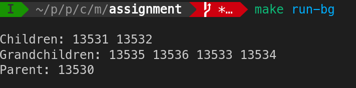
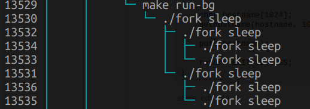

# Nested Fork

## A demonstration of nested forking in C

This program creates a two child processes from the parent process and further creates two child processes from each child process creating four grandchild processes.

Effectively, 7 processes are created (including the parent process).

### Simple steps to run

* Clone the repository
  
```bash
    git clone git@github.com:hacksdump/Nested-Fork.git
```

* Compile the code
  
```bash
    make
```

* Run
  
```bash
    git clone git@github.com:hacksdump/Nested-Fork.git
```

* Run in background (for visualisation in htop)

```bash
    make run-bg
```

### Task running in background



### Process tree in htop



* Press Ctrl + C (SIGINT) to terminate the process.

* Clean the build

```bash
    make clean
```
