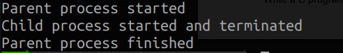

# CSN-361

## Computer and Networks Laboratory

### Assignment 2

> Harshit Maurya  
> 17114037

### Problems
  
**1. Write a socket program in C to connect two nodes on a network to communicate with each other,
where one socket listens on a particular port at an IP, while other socket reaches out to the other
to form a connection.**

#### *Solution*

Main listener Loop

```C
while (1)
    {
        new_socket = accept(server_fd, (struct sockaddr *)&address, (socklen_t *)&addrlen);
        if (new_socket < 0)
        {
            raise_error("accept");
        }
        valread = read(new_socket, buffer, 1024);
        printf("Client: %s\n", buffer);
        send(new_socket, connection_reply, strlen(connection_reply), 0);
        printf("Hello message sent\n");
    }
```

Dynamic Port Allocation

```C
    while (bind(server_fd, (struct sockaddr *)&address, sizeof(address)) < 0)
    {
        address.sin_port = htons(++port);
    }
```

Server running on left side and client running on right side.


**2. Write a C program to demonstrate both Zombie and Orphan process.**

Orphan

```C
    if (pid > 0)
    {
        printf("In parent process\n");
        printf("Parent process terminated\n");
    }
    else if (pid == 0)
    {
        printf("Started child process\n");
        sleep(5);
        printf("Child process terminated\n");
    }
```


Zombie

```C
    if (child_pid > 0)
    {
        printf("Parent process started\n");
        sleep(5);
        printf("Parent process finished\n");
    }
    else
    {
        printf("Child process started and terminated\n");
        exit(0);
    }
```


