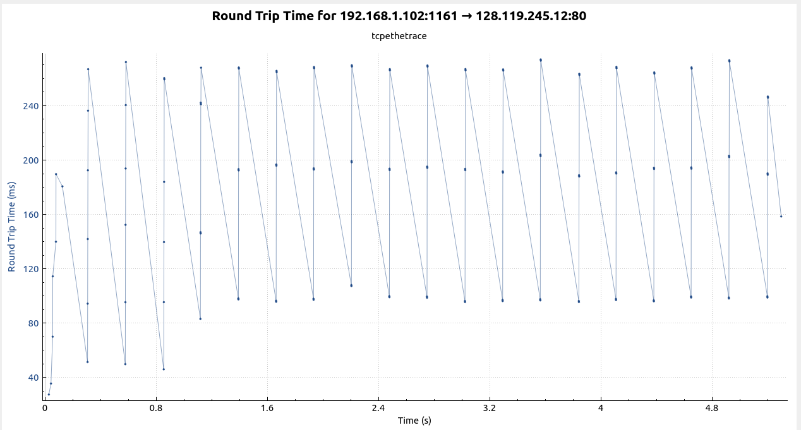

# Problem 3

## Harshit Maurya

### 17114037

a.  IP: 192.168.1.102  
    PORT: 1161

b.  IP: 128.119.245.12  
    PORT: 80

c.  Sequence number of the TCP SYN segment is used to initiate the TCP connection between the client computer and server. The value is 0 in this trace.

    The SYN flag is set to 1 and it indicates that this segment is a SYN segment.

d.  Sequence number of the SYNACK segment from ser1 to the client computer in reply to the SYN has the value of 0 in this trace.

    The value of the ACKnowledgement field in the SYNACK segment is 1.
    
    The value of the ACKnowledgement field in the SYNACK segment is determined by ser1 by adding 1 to the initial sequence number of SYN segment from the client computer (i.e. the sequence number of the SYN segment initiated by the client computer is 0.).

    The SYN flag and Acknowledgement flag in the segment are set to 1 and they indicate that this segment is a SYNACK segment.

e.  No. 4 segment is the TCP segment containing the HTTP POST command. It's sequence no. is 1.

f.  The HTTP POST segment is considered as the first segment. Segments 1 – 6 are No. 4, 5, 7, 8, 10, and 11 in this trace respectively. The ACKs of segments 1 – 6 are No. 6, 9, 12, 14, 15, and 16 in this trace.

    EstimatedRTT = 0.875 * EstimatedRTT + 0.125 * SampleRTT

    EstimatedRTT after the receipt of the ACK of segment 1:
    EstimatedRTT = RTT for Segment 1 = 0.02746 second

    EstimatedRTT after the receipt of the ACK of segment 2:
    EstimatedRTT = 0.875 * 0.02746 + 0.125 * 0.035557 = 0.0285

    EstimatedRTT after the receipt of the ACK of segment 3:
    EstimatedRTT = 0.875 * 0.0285 + 0.125 * 0.070059 = 0.0337

    EstimatedRTT after the receipt of the ACK of segment 4:
    EstimatedRTT = 0.875 * 0.0337+ 0.125 * 0.11443 = 0.0438

    EstimatedRTT after the receipt of the ACK of segment 5:
    EstimatedRTT = 0.875 * 0.0438 + 0.125 * 0.13989 = 0.0558

    EstimatedRTT after the receipt of the ACK of segment 6:
    EstimatedRTT = 0.875 * 0.0558 + 0.125 * 0.18964 = 0.0725

g.  62, 62, 54, 619, 1514, 60

h.  The minimum amount of buffer space (receiver window) advertised at server for the entire trace is 5840 bytes, which shows in the first acknowledgement from the server.
This receiver window grows steadily until a maximum receiver buffer size of 62780 bytes. The sender is never throttled due to lacking of receiver buffer space by inspecting this trace.

i.  After turning on cumulative bytes,

    Total transferred = 164091 - 1  = 164090 bytes
    Time = 5.651141 - 0.026477 = 5.624664
    Throughput = 164090 / 5.624664 = 29173.298 bytes = 28.4895 Kb
